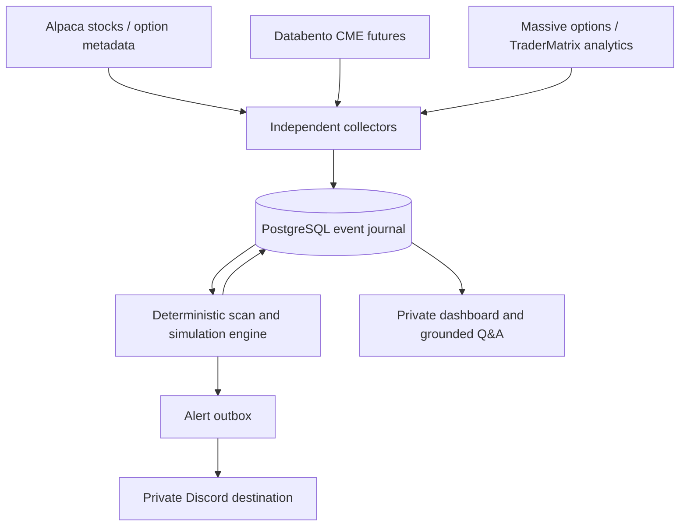

# Architecture and implementation contract

Market Compass combines the shared-context idea from the supplied Toohotz material, TraderMatrix/Cipher analytics views, and the independent-recording pattern from Session Automation Stack. It keeps the first month focused on data quality and simulated decisions.

## Contracts

An event has a stable unique key, provider, symbol, source/event timestamp, receive timestamp, kind and JSON payload. Current views are separate state records. Timestamps are UTC epoch seconds internally and America/Chicago in the UI.

Futures use resolved instrument IDs in state keys. A new contract cannot silently inherit the old contract's levels or position. Mapping messages are journaled. Continuous aliases are subscription inputs, not execution identifiers.

The engine advances its bar cursor, records a signal, changes simulated positions and creates alert events in one database transaction. A rollback leaves the entire decision available for retry. Later bar corrections are stored but do not rewrite already-issued decisions. A database lease serializes engine processes during deployment overlap.

A signal is not a fill. A market simulation must have a quote after the signal, within five seconds of decision time, with a valid spread and nonzero bid/ask sizes. It crosses the observed spread with one additional adverse tick. It never fills using an LLM's number. Entry size respects a fixed planned-risk budget and position caps.

Exits require fresh quotes. Stops discovered in intervening closed bars are handled conservatively and targets still need an observed quote. Quotes are sampled, so fast price excursions, queue priority and actual achievable fills cannot be reconstructed perfectly. Missing exit data leaves an open unresolved record and creates a management-blocked alert.

## Provider roles

| Input | Primary | Fallback / limitation |
|---|---|---|
| US stock prices and bars | Existing Alpaca SIP | IEX only if explicitly selected; no silent downgrade |
| MES/MNQ futures | Databento GLBX.MDP3 live | No Alpaca substitute |
| Option chain, Greeks, daily OI | Massive | Alpaca chain + contract metadata if Massive absent |
| Selected option prints and quotes | Massive WebSocket | Alpaca stream not yet implemented |
| Local GEX/VEX | Deterministic derived proxy | Independent of TraderMatrix |
| Vendor exposure and unusual activity | TraderMatrix API | Paid matrix schema normalized; flow follows official example and needs nonempty live validation |
| Q&A | OpenAI Responses API + bounded recorded facts | Dashboard and scanners remain independent |

TraderMatrix/Cipher charts cannot reveal their exact inventory assumptions, filters or proprietary classification. Reproducing their presentation and buying API access does not establish numerical equivalence. Benchmark local output and vendor output separately.

## Access and deployment

GitHub repository: cyberstryder/market-compass (private).
Railway project: Market Compass.
A PostgreSQL volume stores all shared state. No application service uses ephemeral SQLite in production.
Only dashboard receives a public domain. A password and signed HttpOnly session cookie protect market data. An absent password blocks protected routes. Worker services return 404 for market-facing routes.

Each provider retries independently with bounded backoff. Errors do not log keys or full request URLs. This prevents a single missing data entitlement from blocking unrelated inputs. UI health separates market source age, task update age and worker heartbeat. Exchange closure does not hide a dead worker or a provider error. Per-symbol quote readiness uses a five-second age limit; an authenticated stream without events is not marked ready during the session.

## Known engineering follow-ups

1. Validate paid-account schemas, API plans, symbol identity and network connectivity during an open session.
2. Add large-volume batching and durable raw object archives before expanding beyond the bounded options watchlist.
3. Add gap manifests, sequence-based live-stream recovery where the vendor supports it, and a standalone replay runner. Current reconnects refill stock history hourly and futures minute bars on connection; missed raw options ticks are not reconstructed.
4. Validate nonempty TraderMatrix flow rows against the paid feed, monitor moving-page gaps, and verify vendor exposure units before comparing models or using them in a strategy.
5. Add measured options aggressor and multi-leg classifiers only after trade-condition research and truth-set validation.
6. Add rate/dividend curves, actual Greek timestamps, settlement metadata and exposure-model comparison reports.
7. Validate macro-event blackout rules and prop-account session policies before any later execution work.
8. Evaluate partial exits/runners and strategy refinements only through versioned forward-test tracks.

## Official references reviewed

- [Alpaca stock stream](https://docs.alpaca.markets/us/docs/real-time-stock-pricing-data)
- [Alpaca options stream](https://docs.alpaca.markets/us/docs/real-time-option-data)
- [Massive option chain snapshots](https://massive.com/docs/rest/options/snapshots/option-chain-snapshot)
- [Databento live API](https://databento.com/docs/api-reference-live)
- [OpenAI Responses API](https://developers.openai.com/api/reference/resources/responses/methods/create/)
- [TraderMatrix developer reference](https://www.tradermatrix.pro/developers): REST reference includes the unusual-activity example and paging parameters; paid GEX matrix responses were inspected separately.
- [Discord webhook reference](https://docs.discord.com/developers/resources/webhook): execute webhook with `wait=true` for saved-message confirmation.

Uploaded reference documents were read before implementation. None of their example prices, signals or profit claims are used as live data.
